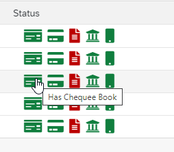

# SAPUI5-Icons


Implementing [Font Awesome](https://fontawesome.com/) Icons in SAPUI5

## Properties
| Name          | Type          | Default Value     | Description 
| ------------- |-------------  |-----------------  |-------------
| style         | String        | fas               | Style (fas, far, fal, fad, fab) [More](https://fontawesome.com/how-to-use/on-the-web/referencing-icons/basic-use).
| hint          | String        |                   | Hint mouse over Text
| size          | String        | fa-1x             | Size (fa-xs, fa-sm, fa-lg, fa-2x, fa-3x) [More](https://fontawesome.com/how-to-use/on-the-web/styling/sizing-icons).
| src           | String        |                   | Icon Name 
| color         | String        | #32363a           | Standard Color Code


## Configuration
- #### Add css URL in manifest.json
```xml
{
	"uri": "https://cdn.jsdelivr.net/npm/@fortawesome/fontawesome-free@5.15.3/css/all.min.css"
}
```
- #### Define the Icon in view
```xml
<HBox>
    <aiExpense:Icons style="fas" hint="Active" size="fa-1x" src="shield-check" color="#107e3e" />
    <aiExpense:Icons style="fas" hint="Has Chequee Book" size="fa-1x" src="money-check" color="#107e3e" />
	<aiExpense:Icons style="fas" hint="Has Debit Card" size="fa-1x" src="credit-card" color="#107e3e" />
	<aiExpense:Icons style="fas" hint="Has Password" size="fa-1x" src="file-alt" color="#b00" />
	<aiExpense:Icons style="fas" hint="Has NetBanking" size="fa-1x" src="university" color="#107e3e" />
	<aiExpense:Icons style="fas" hint="Has UPI" size="fa-1x" src="mobile" color="#107e3e" />
	<aiExpense:Icons style="fas" hint="Has AutoDebit" size="fa-1x" src="repeat-alt" color="#107e3e" />
</HBox>
```
- #### Preview
